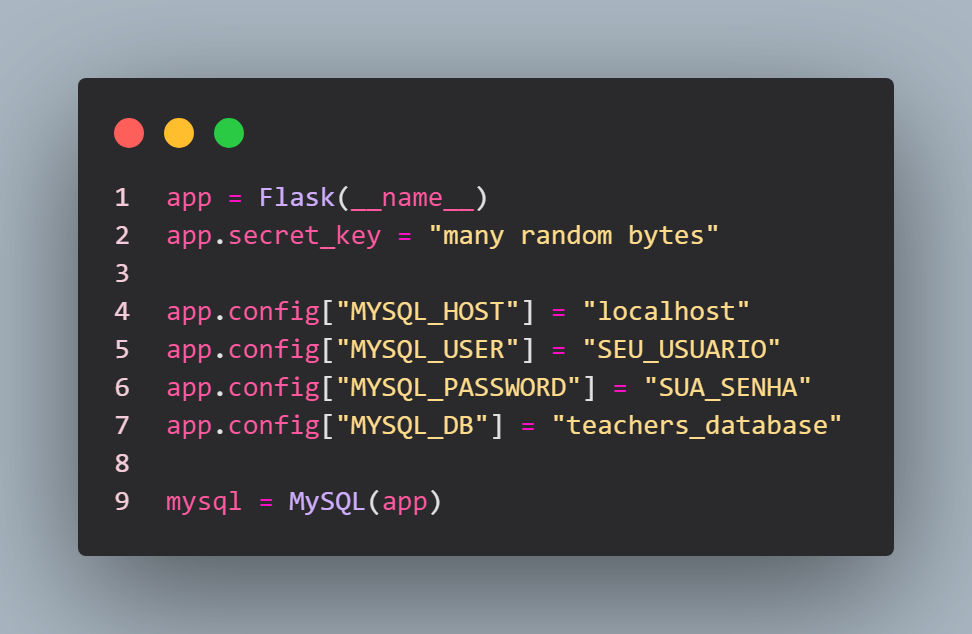
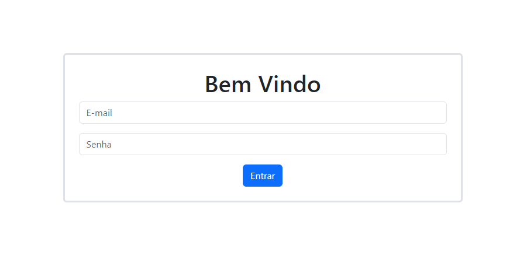
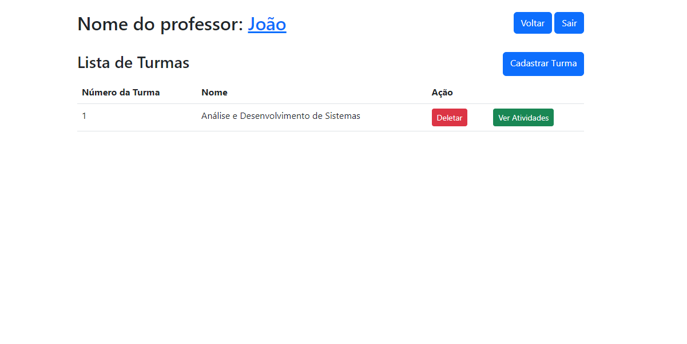
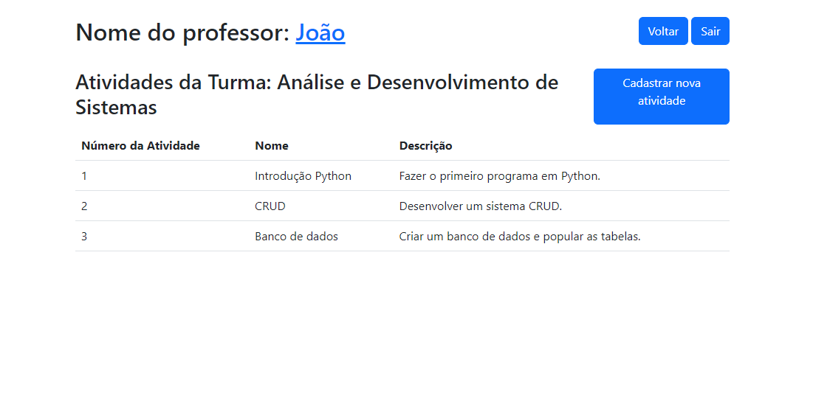
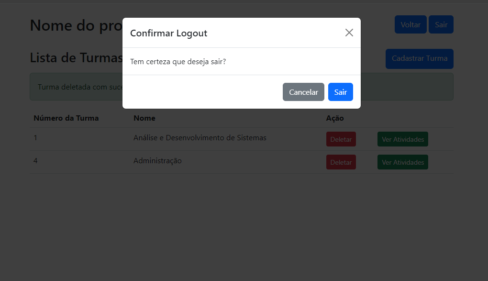
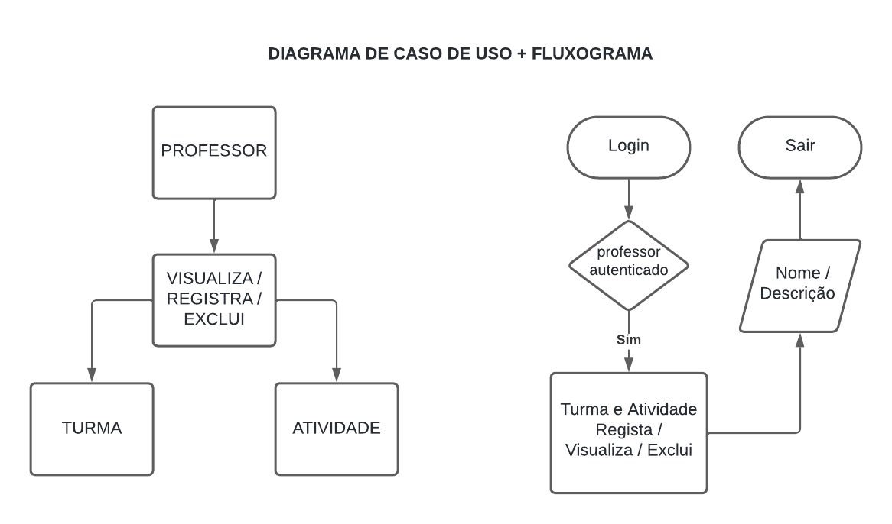
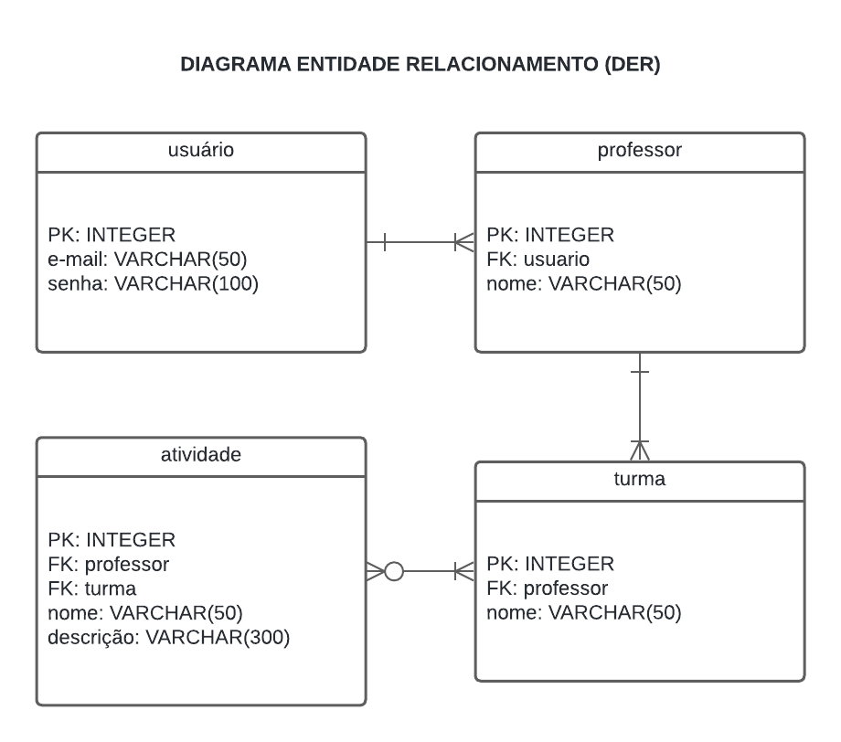

# O sistema
Para a instalação do sistema desenvolvido, aqui está uma lista de requisitos de infraestrutura:

### Sistema de Gerenciamento de Banco de Dados (SGBD) e versão:

MySQL versão 8.0.26

### Linguagem de Programação e versão:

Linguagem: Python <br>
Versão: 3.12.0

### Ambiente de Desenvolvimento:

IDE/Suite de Desenvolvimento: Visual Studio Code com suporte a Python e Flask <br>

### Dependências e Pacotes: Listados no arquivo requirements.txt com as seguintes versões: 

blinker==1.8.2 <br>
click==8.1.7 <br>
colorama==0.4.6 <br>
Flask==3.0.3 <br>
Flask-Assets==2.1.0 <br>
Flask-MySQL==1.5.2 <br>
Flask-MySQLdb==2.0.0 <br>
itsdangerous==2.2.0 <br>
Jinja2==3.1.4 <br>
MarkupSafe==2.1.5 <br>
mysql-connector-python==8.4.0 <br>
mysqlclient==2.2.4 <br>
PyMySQL==1.1.1 <br>
webassets==2.0 <br>
Werkzeug==3.0.3

### Outros Requisitos:

Bibliotecas e Ferramentas Adicionais: pip para gerenciamento de pacotes Python e virtualenv para gerenciamento de ambientes virtuais Python.

## Instruções: 

Após ter feito o clone do projeto, crie uma virtualenv usando o comando:
``` bash
python -m venv .venv
```
Ative a virtualenv:
``` bash
.venv/Scripts/activate
```
Instale as dependências:
``` bash
pip install -r requirements.txt
```
O banco de dados `teachers_database` está disponível localmente no ambiente de desenvolvimento, utilizando a interface web do phpMyAdmin. 



No banco de dados há 3 usuários cadastrados, use-os para fazer o login:

1 - E-mail: daniel@email.com senha: `1234` <br>
2 - E-mail: camila@email.com senha: `1234` <br>
3 - E-mail: cristina@email.com senha: `1234`

O desafio é criar um sistema que permita aos professores se autenticarem e interagirem com suas turmas. Este sistema web ou desktop deve oferecer funcionalidades para:

1. Autenticação: Os professores devem poder se autenticar no sistema com suas credenciais.



2. Gerenciamento de Turmas: Permitir aos professores visualizar, registrar e excluir turmas.



3. Registro de Atividades: Os professores devem poder registrar atividades para suas turmas.



4. Desconexão: Facilitar a saída segura do sistema pelos professores.



### Aqui está um resumo dos passos principais para o desenvolvimento do sistema:

1. Diagrama de Casos de Uso: Criar um diagrama para representar os atores, casos de uso e seus relacionamentos, conforme as regras de negócio descritas.



2. Diagrama Entidade-Relacionamento (DER): Desenvolver o DER com as tabelas, relacionamentos, campos, chaves primárias e estrangeiras, especificando os tipos de dados, adequado ao SGBD utilizado.



3. Script de Criação e População do Banco de Dados: Elaborar um script SQL para criar o banco de dados "saep_database" e suas tabelas, incluindo pelo menos três registros por tabela.

4. Tela de Autenticação de Usuários (Login): Implementar uma tela de login para que os usuários possam se autenticar com e-mail e senha. Após a autenticação, redirecionar para a tela principal do professor.

5. Tela Principal do Professor: Desenvolver a tela principal onde o professor pode ver seu nome, acessar funcionalidades de logout, cadastro de turmas, listagem de turmas, e ações para cada turma.

6. Cadastro de Turma: Criar uma tela para o cadastro de turmas, onde o professor insere o nome da turma, e registra a turma no banco de dados.

7. Listar Turmas do Professor: Na tela principal, listar todas as turmas atribuídas ao professor, permitindo a exclusão de turmas e a visualização de suas atividades.

8. Exclusão da Turma: Implementar a funcionalidade de exclusão de turmas, com uma confirmação para o usuário e a prevenção de exclusão de turmas com atividades associadas.

9. Tela de Atividades da Turma: Desenvolver a tela onde o professor pode cadastrar e visualizar as atividades das turmas.

10. Listar Atividades da Turma: Exibir as atividades registradas no banco de dados para a turma selecionada, juntamente com o nome da turma.

11. Cadastrar Atividade: Criar uma interface para que o professor registre novas atividades para a turma, registrando a atividade no banco de dados.

12. Logout: Implementar a funcionalidade de logout que encerra a sessão do usuário e redireciona para a tela de login.